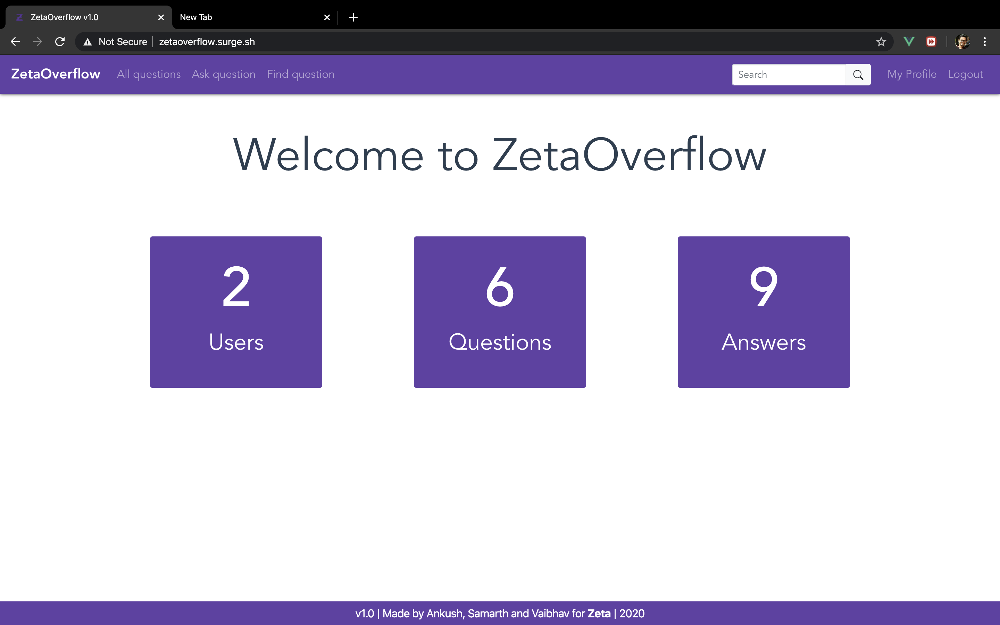
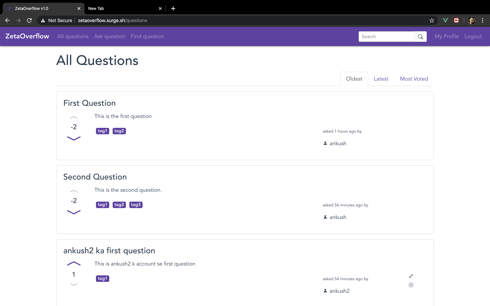
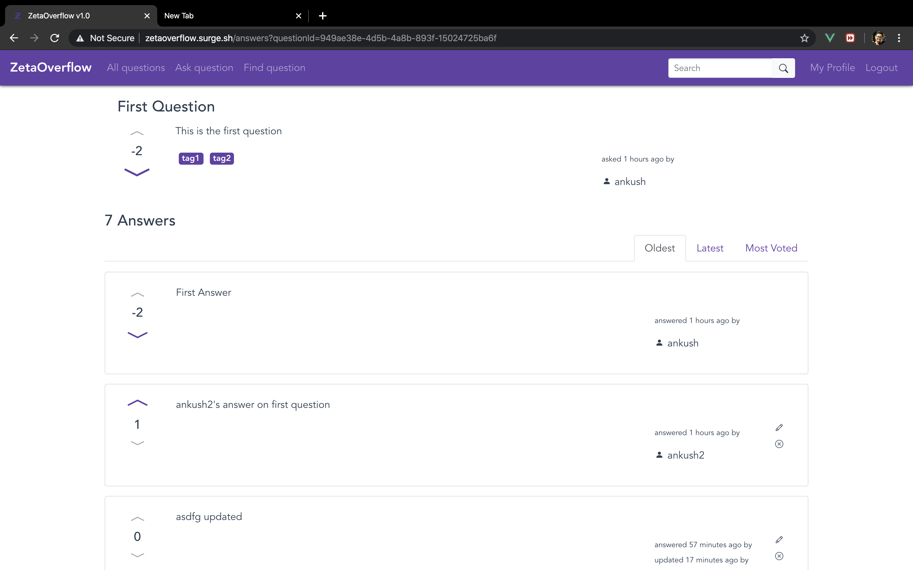
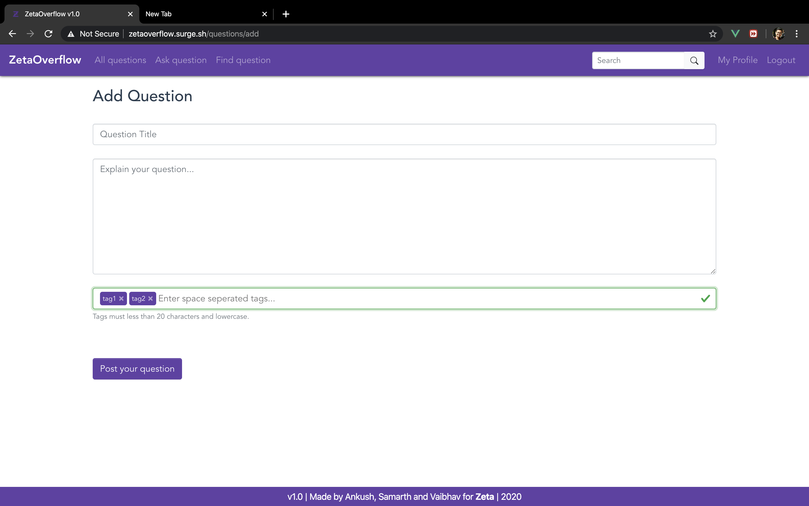
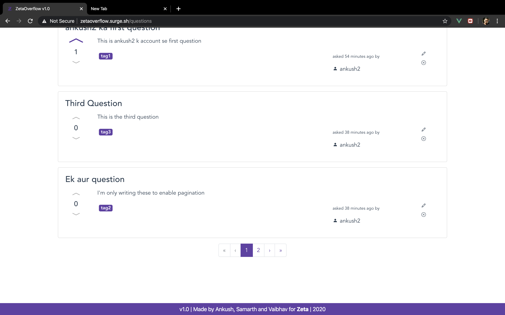
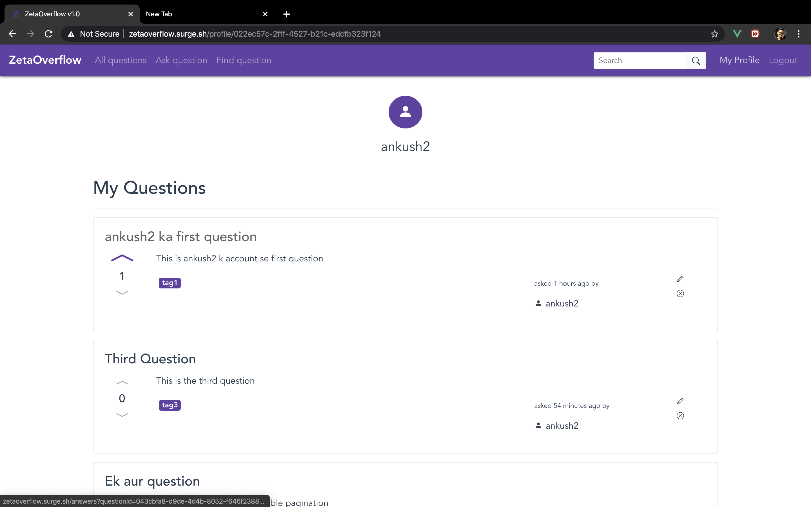
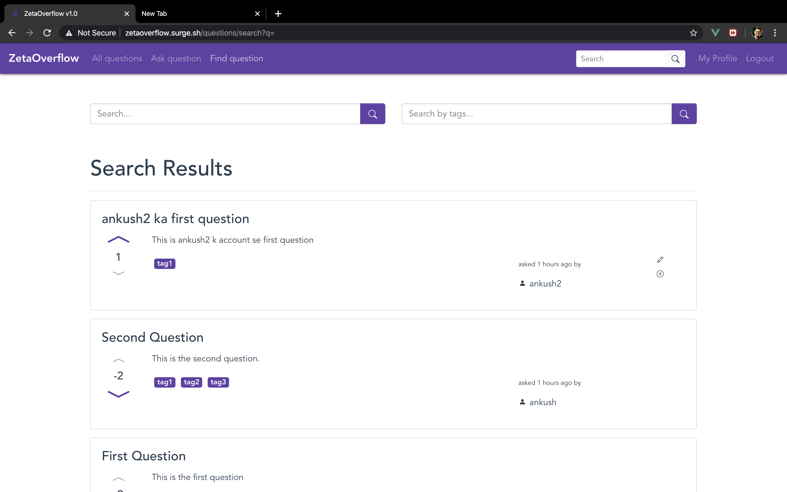
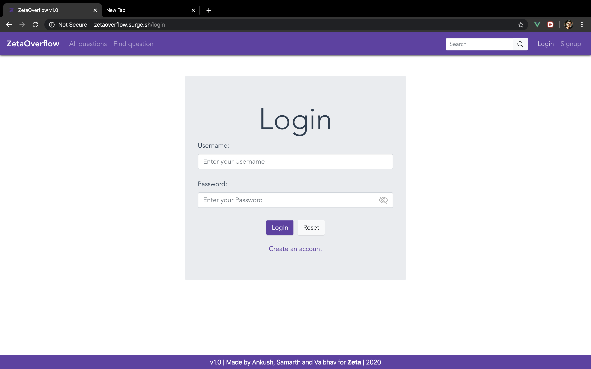
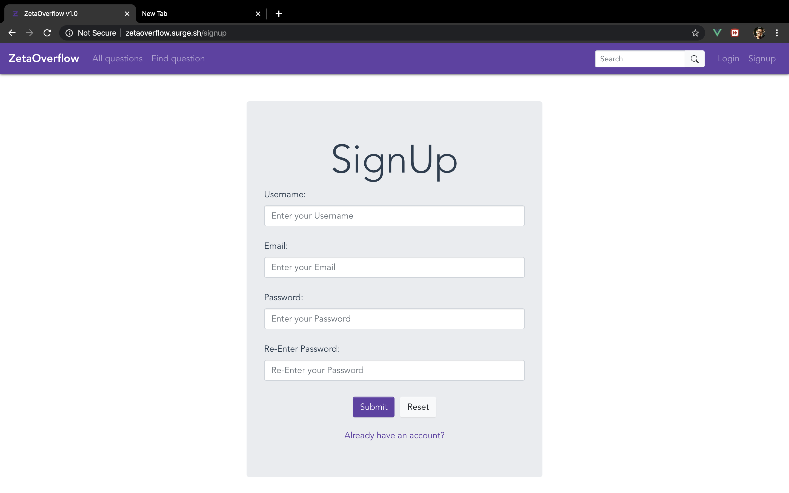

# Zetaoverflow v1.0
[ZetaOverflow](http://zetaoverflow.surge.sh/) is a minimal clone of StackOverflow which is basically a Q &amp; A web app built on Spring Boot, VueJS and PostgreSQL. This is built as an attempt to get acquainted with the tech stack at Zeta.

### Basic Features
- A user with an account can ask questions and post answers on the platform.
- Any visitor can view any and all questions and answers on the platform.
- Any user with an account can upvote/downvote a question/answer.
- Questions and answers can be edited and deleted (only by their creator).
- Tags can be attached to questions while creating and updating.
- All questions and answers are attached with a username (of the creator), number of votes, and a creation and updation timestamp.

### Bonus Features
- SEARCH: Semantic search on the basis of the title and description of a question is available. Users can also narrow down their search response with applying filters on the basis of tags.
- SORT: All questions and answers can be sorted on the basis of oldest, latest and most number of votes.
- PAGINATION: Questions and answers are paginated as soon as they exceed more than 5 per page.
- SECURITY: The authentication and authorization functionality is implemented with JWT (JSON web tokens) mechanism.
- PROFILE: A profile page is added which a user can see profiles any user which contains a list of his questions and answers.

### Screenshots

#### API Docs
https://documenter.getpostman.com/view/10288864/SWTEdGan
